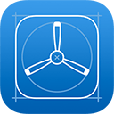
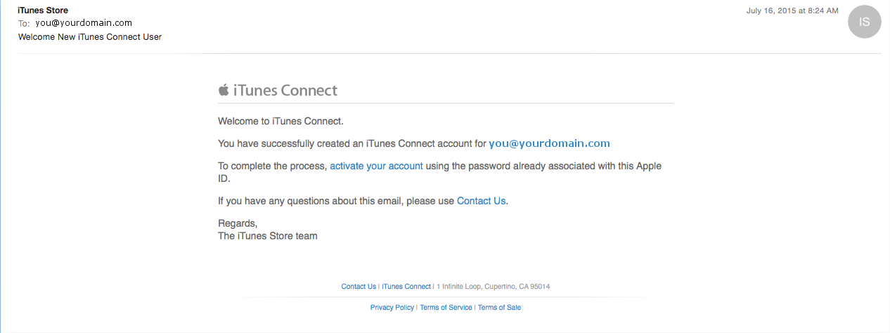
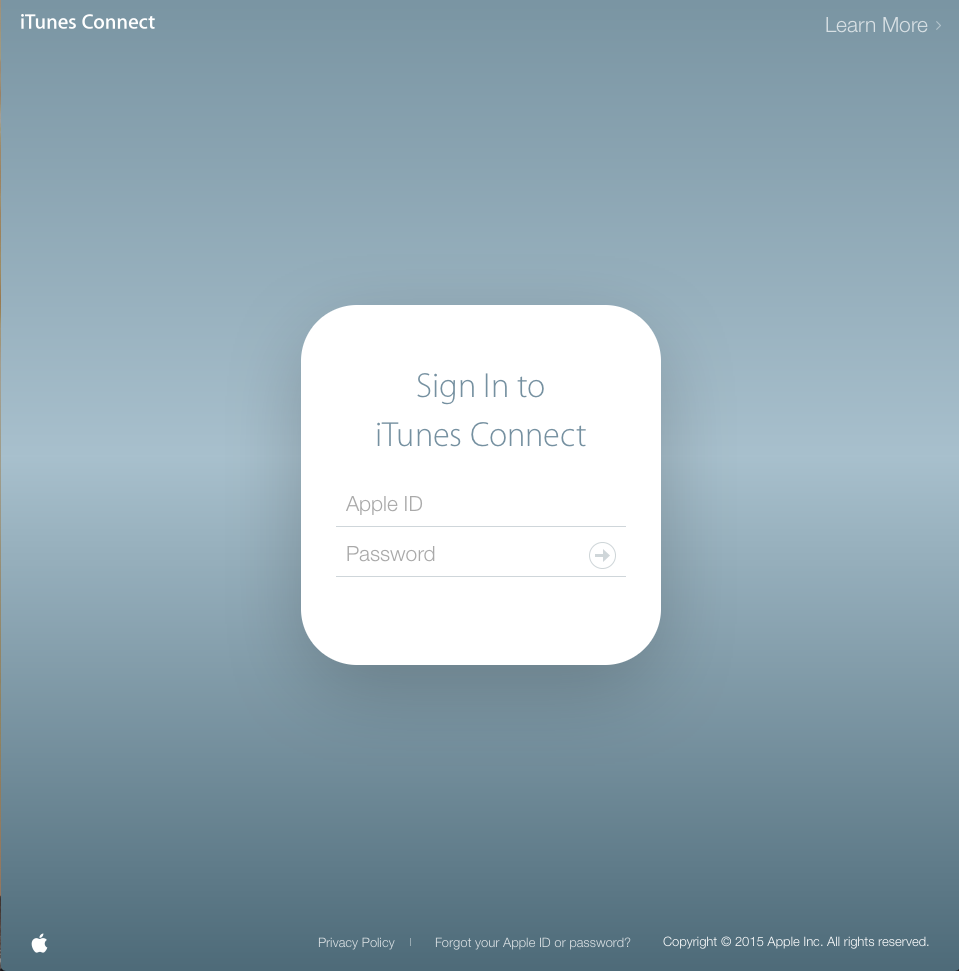
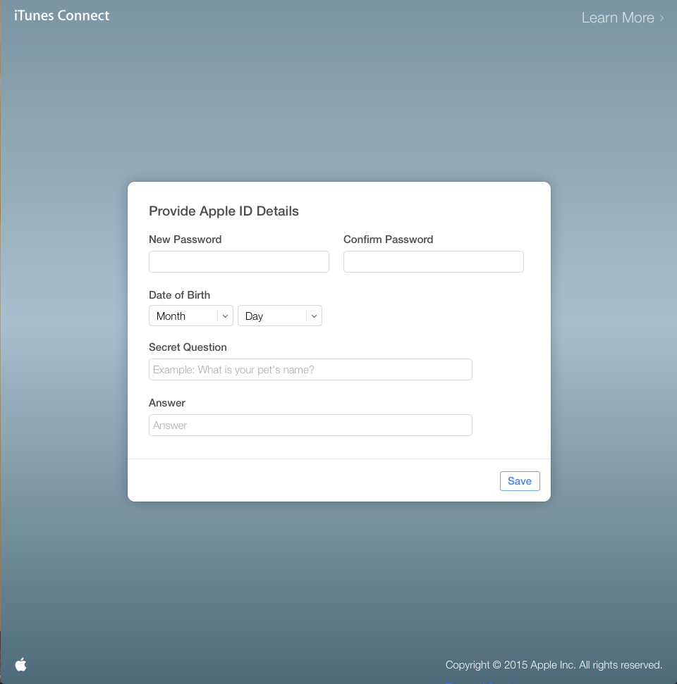
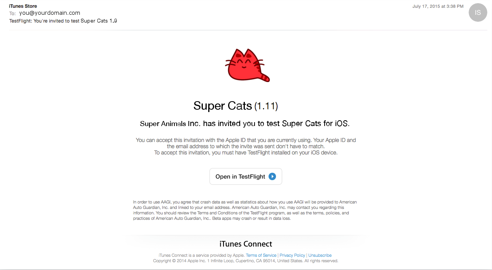
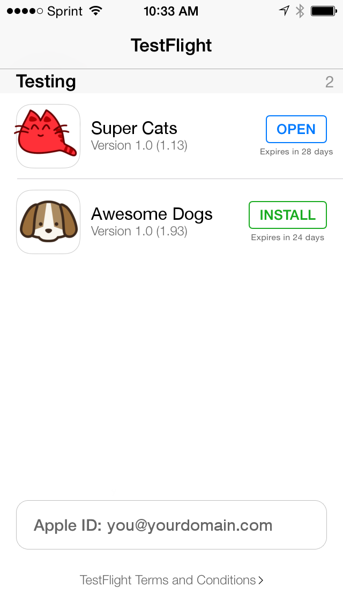

# TestFlight Beta Testing for iOS

* iTunes Connect Activation Email
> After you have provided Solid with the email you use to sign into iTunes on your device, you will receive an email confirmation from iTunes Store. Click the "activate your account" link.

* iTunes Connect Sign In
> You will be directed the the iTunes Connect Sign In Screen.

* Reset Password
> Or the the iTunessConnect Reset Password Screen.

* TestFlight Invitation Email
> By signing in or reseting your password you have confirmed your identity and will soon receive another email from iTunes Store:TestFlight inviting you to be a beta tester.

* TestFlight App
> Select "Open in TestFlight" and you will either be redirected to the App Store to download the TestFlight app, or if it's already installed it will open with a list of apps you are authorized to beta test.

* From here you can download and test your app. You will receive Push Notifications when new builds are available.

## Happy Testing!

